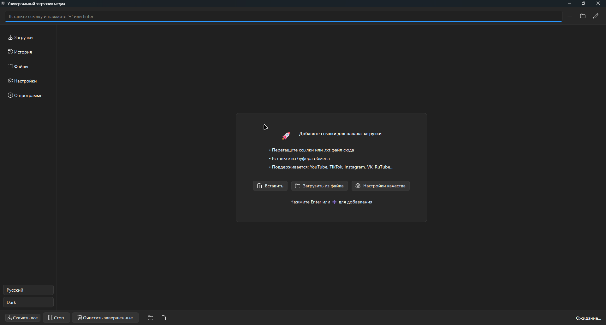
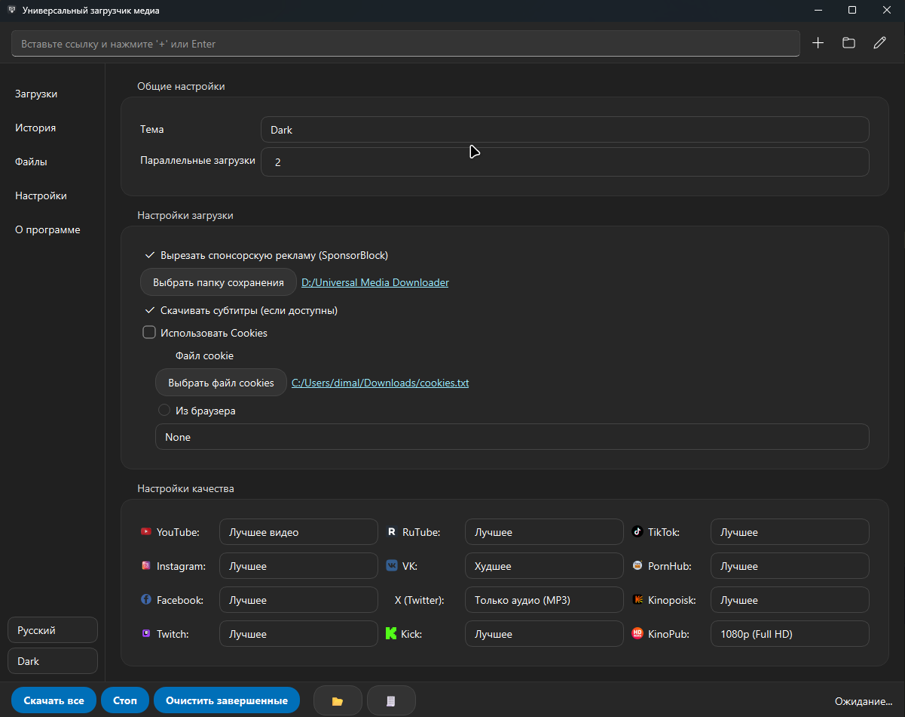

# Universal Media Downloader v2.4

<p align="center">
  
</p>

<p align="center">
  <b>Универсальный загрузчик медиа</b> - десктопное приложение для скачивания видео, аудио и прямых эфиров с популярных платформ.
</p>

<p align="center">
  <a href="#что-нового-в-версии-23">Что нового</a> •
  <a href="#возможности">Возможности</a> •
  <a href="#требования">Требования</a> •
  <a href="#установка">Установка</a> •
  <a href="#использование">Использование</a> •
  <a href="#скриншоты">Скриншоты</a>
</p>

---

## ✨ Что нового в версии 2.4 

- 🎥 **Запись прямых эфиров Twitch:** Полноценная поддержка захвата текущих трансляций в реальном времени.
- ✂️ **вырезка в файл:** Интегрирована обрезка видео в разделе файл.


---

## Возможности

- **Поддержка платформ**: YouTube, TikTok, Instagram, VK, RuTube, Twitch (VOD и Live), Kick, Kinopoisk, KinoPub и другие.
- **Выбор качества**: Индивидуальные настройки разрешения для каждой платформы.
- **Извлечение аудио**: Быстрая конвертация в MP3 (192kbps).
- **Параллельные загрузки**: Настраиваемое количество одновременных потоков.
- **История загрузок**: Отслеживание всех скачанных файлов.
- **Субтитры**: Вшивание субтитров (EN, RU, UK).
- **Cookies**: Авторизация через файл `cookies.txt` или напрямую из браузера (Chrome, Opera, Edge, Firefox, Brave и др.).
- **Drag & Drop**: Быстрое перетаскивание ссылок и списков из `.txt` файлов.
- **Темы**: Полная поддержка тёмной и светлой темы интерфейса.
- **Локализация**: Русский, английский, украинский интерфейс.
- **Автообновление**: Фоновая проверка обновлений ядра yt-dlp при запуске.

## Требования

- **Python** 3.10+
- **Deno** 2.0+ (требуется для обхода новых защит YouTube)

### Установка Deno (обязательно для YouTube)

**Windows (PowerShell):**
```powershell
irm [https://deno.land/install.ps1](https://deno.land/install.ps1) | iex

### FFmpeg

FFmpeg используется для объединения видео и аудио потоков, конвертации форматов и извлечения аудио.

**Устанавливать FFmpeg не нужно!** Приложение уже содержит все необходимые встроенные бинарные файлы в папке `assets/ffmpeg/`, поэтому программа готова к работе сразу после скачивания.

## Установка

1. **Клонируйте репозиторий:**
```bash
git clone [https://github.com/YOUR_USERNAME/universal-media-downloader.git](https://github.com/YOUR_USERNAME/universal-media-downloader.git)
cd universal-media-downloader
```

2. **Создайте виртуальное окружение:**
```bash
python -m venv .venv
```

3. **Активируйте виртуальное окружение:**

Windows:
```bash
.venv\Scripts\activate
```

4. **Установите зависимости:**
```bash
pip install -r requirements.txt
```

5. **Запустите приложение:**
```bash
python main.py
```

## Использование

1. Вставьте ссылку в поле ввода и нажмите Enter или кнопку "+"
2. Настройте качество в разделе "Настройки" (опционально)
3. Нажмите "Скачать все"

### Поддерживаемые способы добавления ссылок:
- Вставка в поле ввода
- Drag & Drop ссылки или .txt файла
- Вставка из буфера обмена (кнопка "Вставить")

## Скриншоты

<p align="center">
  
</p>

<p align="center">
  
</p>

## Структура проекта

```text
Downloader/
├── app/                    # Основной код приложения
│   ├── main_window.py      # Главное окно
│   ├── files_tab.py        # Встроенный файловый менеджер
│   ├── playlist_dialog.py  # Окно выбора видео из плейлиста
│   ├── download_manager.py # Менеджер загрузок
│   ├── download_task.py    # Модель задачи
│   ├── threads.py          # Воркеры (загрузка, превью)
│   ├── settings_tab.py     # Вкладка настроек
│   ├── history_tab.py      # Вкладка истории
│   ├── about_tab.py        # Вкладка "О программе"
│   ├── theme_manager.py    # Управление темами
│   ├── translation.py      # Система локализации
│   ├── update_checker.py   # Проверка обновлений yt-dlp
│   └── ...
├── assets/                 # Ресурсы
│   ├── ffmpeg/             # FFmpeg бинарники
│   ├── logos/              # Логотипы платформ
│   ├── en.json             # Английская локализация
│   ├── ru.json             # Русская локализация
│   └── uk.json             # Украинская локализация
├── main.py                 # Точка входа
├── requirements.txt        # Зависимости Python
└── README.md
```

## Зависимости

- **PyQt6** - GUI фреймворк
- **yt-dlp[curl-cffi]** - движок загрузки
- **requests** - HTTP клиент
- **yt-dlp[curl-cffi]** - движок загрузки
- **packaging** - работа с версиями

## Известные проблемы

### YouTube не работает / ошибка "Signature solving failed"

Это происходит из-за того, что yt-dlp теперь требует JavaScript runtime для работы с YouTube.

**Решение:**
1. Установите Deno (см. раздел "Требования")
2. Перезапустите приложение

## Автор

**Оригинальный автор:** Magerko  https://github.com/Magerko/universal-media-downloader

**Дополнено (версия 2.30):** MrPablo  

## Лицензия

MIT License - см. файл LICENSE для подробностей.

---

<p align="center">
</p>
