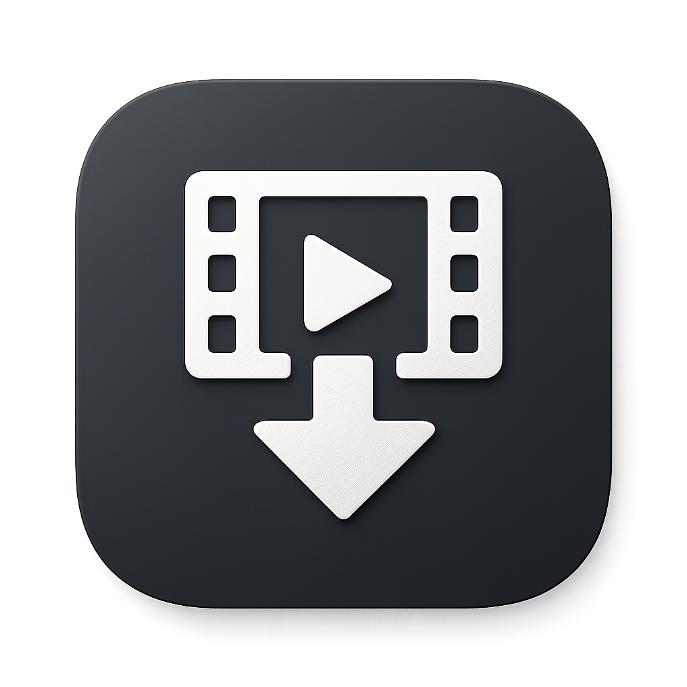
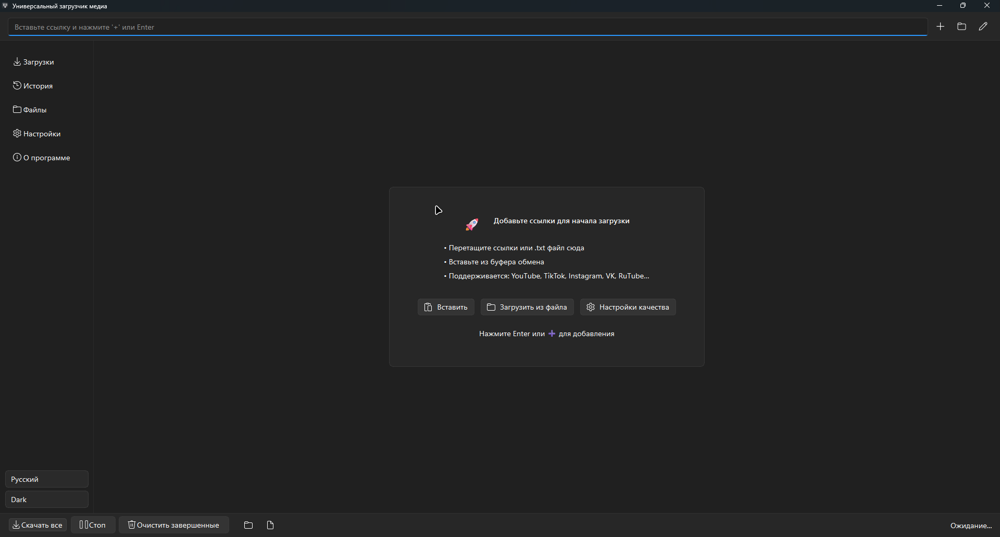
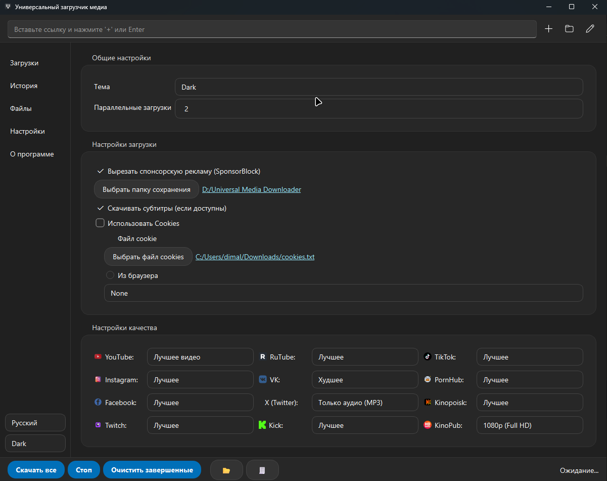

# Universal Media Downloader v3.0

<p align="center">
  
</p>

<p align="center">
  <b>Универсальный загрузчик медиа</b> — десктопное приложение для скачивания видео, аудио и прямых эфиров с популярных платформ.
</p>

<p align="center">
  <a href="#что-нового-в-версии-30">Что нового</a> •
  <a href="#возможности">Возможности</a> •
  <a href="#особенности-работы-с-онлайн-кинотеатрами">Особенности кинотеатров</a> •
  <a href="#требования">Требования</a> •
  <a href="#установка">Установка</a> •
  <a href="#использование">Использование</a> •
  <a href="#скриншоты">Скриншоты</a>
</p>

---

## Что нового в версии 3.0

- **Полный редизайн интерфейса**: современный внешний вид на базе Fluent Design.
- **Поддержка vi3000.top (Lampa / Cub)**: интерактивный выбор медиа через вспомогательное окно браузера и автоперехват видеопотока при старте плеера.
- **Новый движок для KinoPub / Rezka**:
  - Больше не нужно вручную прогружать страницы сайта или копировать прямые ссылки.
  - Появилось модальное окно выбора: качество (от 360p до 1080p/4K), студия озвучки, сезон и конкретная серия.
  - Поддержка скачивания **всего сезона целиком** в один клик.
- **Удаленное управление (Telegram-бот)**: отправка ссылок со смартфона в бота — программа на ПК автоматически ставит их в очередь.

---

## Возможности

- **Поддержка платформ**: YouTube, TikTok, Instagram, VK, RuTube, Twitch (VOD и Live), Kick, vi3000.top (Lampa), Kinopoisk, KinoPub / Rezka и многие другие.
- **Интерактивный выбор серий и озвучки**: встроенные окна настроек для кинотеатров с возможностью пакетной загрузки сезонов.
- **Удаленное управление**: встроенный Telegram-бот для автоматического приема ссылок с других устройств.
- **Встроенная визуальная обрезка**: нарезка видеофайлов прямо внутри приложения.
- **Выбор качества**: индивидуальные настройки разрешений для различных платформ.
- **Извлечение аудио**: быстрая конвертация звуковых дорожек в MP3 (192 kbps).
- **Параллельные загрузки**: настраиваемое число одновременно скачиваемых файлов.
- **История загрузок**: удобный список всех ранее загруженных медиа.
- **Субтитры**: автопоиск и вшивание дорожек субтитров (RU, EN, UK).
- **Cookies**: авторизация через `cookies.txt` или автоматический импорт куков из браузеров (Chrome, Edge, Opera, Firefox и др.).
- **Drag & Drop**: перетаскивание ссылок и `.txt` списков прямо в окно программы.
- **Темы оформления**: плавная смена светлой и тёмной тем.
- **Локализация**: поддержка русского, английского и украинского языков.
- **Автообновление**: фоновая проверка свежих версий ядра yt-dlp при запуске.

---

## Особенности работы с онлайн-кинотеатрами

### Задержка 10–20 секунд при добавлении KinoPub / Rezka
При добавлении ссылки с KinoPub или Rezka приложение может кратковременно перестать реагировать на 10–20 секунд (в строке статуса отображается: *«Обход защиты сайта и поиск серий...»*).

**Это нормальный рабочий процесс:**
1. Для обхода защиты сайта (Cloudflare / антибот-проверки) программа в фоне открывает скрытый экземпляр браузера (Edge Chromium).
2. Скрипт получает cookies сессии, считывает список доступных озвучек, сезонов, серий и доступные разрешения видео.
3. Как только фоновая прогрузка завершается, открывается окно, в котором можно выбрать озвучку, сезон, серию или отправить на скачивание весь сезон целиком.

### Скачивание с vi3000.top (Lampa / Cub)
1. Вставьте ссылку на `vi3000.top` в поле ввода программы.
2. Автоматически откроется окно браузера с интерфейсом кинотеатра.
3. Перейдите к нужному фильму или сериалу, выберите подходящую озвучку, сезон, серию и качество.
4. Нажмите «Play» (запустите воспроизведение в плеере).
5. Программа автоматически поймает поток, добавит файл в очередь загрузок и сама закроет вспомогательное окно браузера.

## Требования

- **Python** 3.11+
- **Deno** 2.0+ (требуется для обхода новых защит YouTube)

### Установка Deno (обязательно для YouTube)

**Windows (PowerShell):**
```powershell
irm [https://deno.land/install.ps1](https://deno.land/install.ps1) | iex

### FFmpeg

FFmpeg используется для объединения видео и аудио потоков, конвертации форматов и извлечения аудио.

**Устанавливать FFmpeg не нужно!** Приложение уже содержит все необходимые встроенные бинарные файлы в папке `assets/ffmpeg/`, поэтому программа готова к работе сразу после скачивания.

## Установка

1. **Клонируйте репозиторий:**
```bash
git clone [https://github.com/YOUR_USERNAME/universal-media-downloader.git](https://github.com/YOUR_USERNAME/universal-media-downloader.git)
cd universal-media-downloader
```

2. **Создайте виртуальное окружение:**
```bash
python -m venv .venv
```

3. **Активируйте виртуальное окружение:**

Windows:
```bash
.venv\Scripts\activate
```

4. **Установите зависимости:**
```bash
pip install -r requirements.txt
```

5. **Запустите приложение:**
```bash
python main.py
```

## Использование

1. Вставьте ссылку в поле ввода и нажмите Enter или кнопку "+"
2. Настройте качество в разделе "Настройки" (опционально)
3. Нажмите "Скачать все"

### Поддерживаемые способы добавления ссылок:
- Вставка в поле ввода
- Drag & Drop ссылки или .txt файла
- Вставка из буфера обмена (кнопка "Вставить")

## Скриншоты

<p align="center">
  
</p>

<p align="center">
  
</p>

## Структура проекта

```text
Downloader/
├── app/                    # Основной код приложения
│   ├── main_window.py      # Главное окно
│   ├── files_tab.py        # Встроенный файловый менеджер
│   ├── telegram_bot.py     # Логика работы Telegram-бота
│   ├── telegram_tab.py     # Вкладка настроек Telegram-бота
│   ├── playlist_dialog.py  # Окно выбора видео из плейлиста
│   ├── download_manager.py # Менеджер загрузок
│   ├── download_task.py    # Модель задачи
│   ├── threads.py          # Воркеры (загрузка, превью)
│   ├── settings_tab.py     # Вкладка настроек
│   ├── history_tab.py      # Вкладка истории
│   ├── about_tab.py        # Вкладка "О программе"
│   ├── theme_manager.py    # Управление темами
│   ├── translation.py      # Система локализации
│   └── update_checker.py   # Проверка обновлений yt-dlp
├── assets/                 # Ресурсы
│   ├── ffmpeg/             # FFmpeg бинарники
│   └── logos/              # Логотипы платформ
├── locales/                # Файлы локализации
│   ├── en.json             # Английская локализация
│   ├── ru.json             # Русская локализация
│   └── uk.json             # Украинская локализация
├── main.py                 # Точка входа
├── requirements.txt        # Зависимости Python
└── README.md
```

## Зависимости

- **PyQt6** - GUI фреймворк
- **yt-dlp[curl-cffi]** - движок загрузки
- **qfluentwidgets - компонент GUI
- **requests** - HTTP клиент
- **yt-dlp[curl-cffi]** - движок загрузки
- **packaging** - работа с версиями
- **pyTelegramBotAPI** - библиотека для работы встроенного Telegram-бота
## Известные проблемы

### YouTube не работает / ошибка "Signature solving failed"

Это происходит из-за того, что yt-dlp теперь требует JavaScript runtime для работы с YouTube.

**Решение:**
1. Установите Deno (см. раздел "Требования")
2. Перезапустите приложение

## Автор

**Оригинальный автор:** Magerko  https://github.com/Magerko/universal-media-downloader

**Дополнено:** MrPablo  

## Лицензия

MIT License - см. файл LICENSE для подробностей.

---

<p align="center">
</p>
