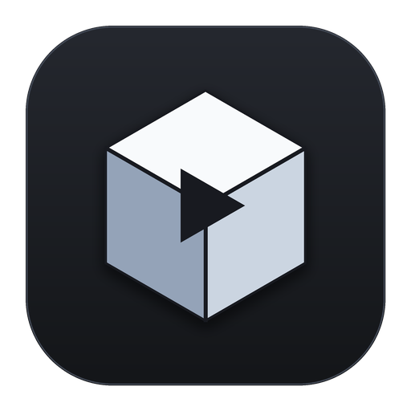
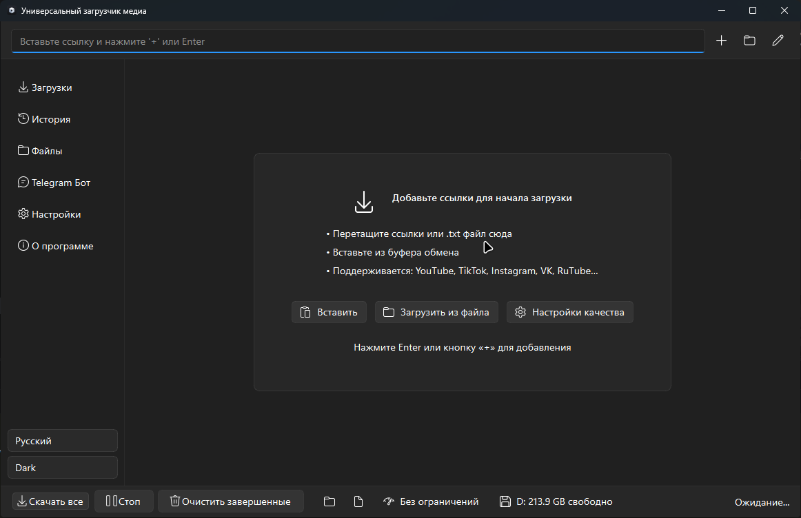
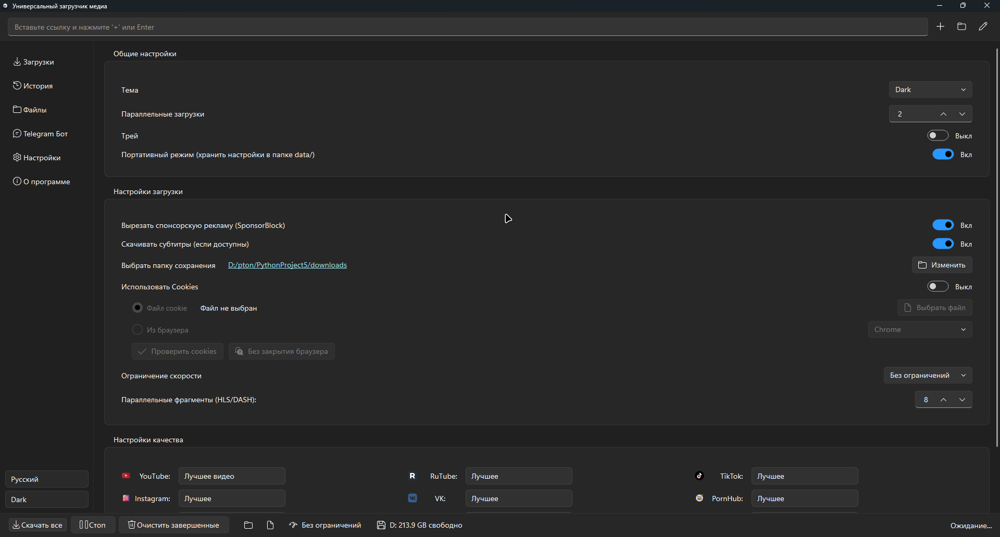

# Universal Media Downloader v3.1

<p align="center">
  
</p>

<p align="center">
  <b>Универсальный загрузчик медиа</b> — мощное десктопное приложение с интерфейсом Fluent Design для скачивания видео, аудио, серий и прямых эфиров с популярных платформ и онлайн-кинотеатров.
</p>

<p align="center">
  <a href="#что-нового-в-версии-31">Что нового</a> •
  <a href="#возможности">Возможности</a> •
  <a href="#особенности-работы-с-онлайн-кинотеатрами">Кинотеатры</a> •
  <a href="#сборка-и-установка">Установка и сборка</a> •
  <a href="#требования-для-запуска-из-исходного-кода">Требования</a> •
  <a href="#использование">Использование</a> •
  <a href="#скриншоты">Скриншоты</a>
</p>

---

## Что нового в версии 3.1

- **Новый фирменный стиль (Hexagon Vault)**: современная объемная иконка в строгом изометрическом стиле без кислотного неона, отлично масштабируемая для Windows 11.
- **Интерактивный диалог парсинга кинотеатров**: оптимизированный выбор для KinoPub / Rezka — студия озвучки, сезон, серия, качество (от 360p до 1080p/4K) и пакетное скачивание сезонов.
- **Оптимизация менеджера загрузок**: повышенная стабильность многопоточной очереди, улучшенная обработка ошибок сети и докачка.
- **Улучшенный Telegram-бот**: повышенная надежность фонового сервиса приема ссылок со смартфона.
- **Обновление локализации и UI**: исправлены строки в русском, английском и украинском переводах, актуализирована вкладка «О программе».
- **Свежие дистрибутивы v3.1**: ультра-сжатый инсталлятор Inno Setup (`Universal_Media_Downloader_v3.1_Setup.exe`) и портативный ZIP-архив (`Windows_UMD_v3.1_Portable.zip`).

---

## Что нового в версии 3.0

- **Полноценный инсталлятор (Inno Setup)**: мультиязычная установка, ярлыки, деинсталлятор.
- **Автономная Portable-версия**: запуск без установки прямо из папки или USB-флешки.
- **Поддержка vi3000.top (Lampa / Cub)**: интерактивный выбор медиа через окно браузера и автоперехват видеопотока.
- **Удаленное управление**: отправка ссылок через Telegram-бота.
- **Полный редизайн интерфейса**: эстетичный внешний вид на базе Fluent Design.

---

## Возможности

- **Поддержка платформ**: YouTube, TikTok, Instagram, VK, RuTube, Twitch (VOD и Live), Kick, vi3000.top (Lampa), Kinopoisk, KinoPub / Rezka и многие другие сервисы.
- **Интерактивный выбор серий и озвучки**: встроенные окна настроек для кинотеатров с возможностью пакетной загрузки сезонов.
- **Удаленное управление**: встроенный Telegram-бот для автоматического приема ссылок с других устройств.
- **Встроенная визуальная обрезка**: нарезка видеофайлов прямо внутри приложения.
- **Выбор качества**: индивидуальные настройки разрешений для различных платформ.
- **Извлечение аудио**: быстрая конвертация звуковых дорожек в MP3 (192 kbps).
- **Параллельные загрузки**: настраиваемое число одновременно скачиваемых файлов.
- **История загрузок**: удобный список всех ранее загруженных медиа.
- **Субтитры**: автопоиск и вшивание дорожек субтитров (RU, EN, UK).
- **Cookies**: авторизация через `cookies.txt` или автоматический импорт куков из браузеров (Chrome, Edge, Opera, Firefox и др.).
- **Drag & Drop**: перетаскивание ссылок и `.txt` списков прямо в окно программы.
- **Темы оформления**: плавная смена светлой и тёмной тем.
- **Локализация**: поддержка русского, английского и украинского языков.
- **Автообновление**: фоновая проверка свежих версий ядра yt-dlp при запуске.

---

## Особенности работы с онлайн-кинотеатрами

### Задержка 10–20 секунд при добавлении KinoPub / Rezka
При добавлении ссылки с KinoPub или Rezka приложение может кратковременно показывать статус: *«Обход защиты сайта и поиск серий...»*.

**Это нормальный рабочий процесс:**
1. Для обхода защиты сайта (Cloudflare / антибот-проверки) программа в фоне открывает скрытый экземпляр браузера (Edge Chromium).
2. Скрипт получает cookies сессии, считывает список доступных озвучек, сезонов, серий и доступные разрешения видео.
3. Как только фоновая прогрузка завершается, открывается окно, в котором можно выбрать озвучку, сезон, серию или отправить на скачивание весь сезон целиком.

### Скачивание с vi3000.top (Lampa / Cub)
1. Вставьте ссылку на `vi3000.top` в поле ввода программы.
2. Автоматически откроется окно браузера с интерфейсом кинотеатра.
3. Перейдите к нужному фильму или сериалу, выберите подходящую озвучку, сезон, серию и качество.
4. Нажмите «Play» (запустите воспроизведение в плеере).
5. Программа автоматически поймает поток, добавит файл в очередь загрузок и сама закроет вспомогательное окно браузера.

---

## Сборка и установка

### 1. Готовый установщик (Installer)
В директории `output/` находится готовый файл установщика:
- **`output/Universal_Media_Downloader_v3.1_Setup.exe`** (~150 МБ).
- Запустите его для стандартной установки на ПК с созданием ярлыков и деинсталлятором.

> **Сборка инсталлятора в 1 клик:**
> Запустите файл `build_installer.bat` в корне проекта (требуется установленный Inno Setup 6).

### 2. Портативная версия (Portable)
Для запуска без установки (например, с USB-носителя):
- Папка: **`output/Windows3.1.UMD/`** (запуск через `Windows3.1.UMD.exe`).
- Готовый архив: **`output/Windows_UMD_v3.1_Portable.zip`**.
- Программа сохраняет конфигурацию и данные локально в подпапке `data/`.

---

## Требования для запуска из исходного кода

- **Python** 3.11+
- **Deno** 2.0+ (рекомендуется для обхода JS-челленджей YouTube)

### Установка Deno (для YouTube)

**Windows (PowerShell):**
```powershell
irm https://deno.land/install.ps1 | iex
```

### Встроенный FFmpeg
**Устанавливать FFmpeg вручную не требуется!** Приложение уже содержит все необходимые встроенные бинарные файлы в папке `assets/ffmpeg/bin/`.

---

## Установка из исходного кода

1. **Клонируйте репозиторий:**
```bash
git clone https://github.com/dimalinau-lab/universal-media-downloader-2.git
cd universal-media-downloader-2
```

2. **Создайте и активируйте виртуальное окружение:**
```bash
python -m venv .venv
.venv\Scripts\activate
```

3. **Установите зависимости:**
```bash
pip install -r requirements.txt
```

4. **Запустите приложение:**
```bash
python main.py
```

---

## Использование

1. Вставьте ссылку в поле ввода и нажмите Enter или кнопку «+».
2. Настройте качество в разделе «Настройки» (при необходимости).
3. Нажмите «Скачать все».

### Способы добавления ссылок:
- Вставка ссылок через интерфейс или горячие клавиши.
- Drag & Drop ссылок или `.txt` файлов со списком URL прямо в окно приложения.
- Отправка ссылок в Telegram-бота с мобильного телефона.

---

## Скриншоты

<p align="center">
  
</p>

<p align="center">
  
</p>

---

## Структура проекта

```text
universal-media-downloader/
├── app/                        # Основной код приложения
│   ├── main_window.py          # Главное окно (Fluent UI)
│   ├── download_manager.py     # Менеджер загрузок и интеграций
│   ├── kinopub_dialog.py       # Диалог серий и сезонов KinoPub/Rezka
│   ├── episode_dialog.py       # Выбор эпизодов
│   ├── telegram_bot.py         # Бэкенд Telegram-бота
│   ├── telegram_tab.py         # Вкладка управления ботом
│   ├── files_tab.py            # Встроенный менеджер загруженных файлов
│   ├── history_tab.py          # История скачиваний
│   ├── settings_tab.py         # Настройки программы и форматов
│   ├── about_tab.py            # О программе
│   ├── theme_manager.py        # Темы оформления (светлая/темная)
│   ├── translation.py          # Локализация
│   └── update_checker.py       # Проверка обновлений yt-dlp
├── assets/                     # Статические ресурсы
│   ├── icon.png / icon.ico     # Новая иконка приложения (Hexagon Vault)
│   ├── ru.json, en.json, uk.json # Файлы локализации
│   ├── ffmpeg/                 # Встроенные бинарники FFmpeg
│   └── logos/                  # Логотипы поддерживаемых сервисов
├── output/                     # Готовые дистрибутивы
│   ├── Windows3.1.UMD/         # Портативная папка с исполняемым файлом
│   ├── Windows_UMD_v3.1_Portable.zip # Портативный ZIP-архив
│   └── Universal_Media_Downloader_v3.1_Setup.exe # Инсталлятор Inno Setup
├── build_config.json           # Конфигурация сборки auto-py-to-exe
├── installer.iss               # Скрипт сборки Inno Setup
├── build_installer.bat         # Быстрая сборка инсталлятора в 1 клик
├── main.py                     # Точка входа в приложение
├── requirements.txt            # Зависимости Python
└── README.md
```

---

## Зависимости

- **PyQt6** — современный GUI фреймворк
- **PyQt-Fluent-Widgets** — компоненты в стиле Windows 11 Fluent Design
- **yt-dlp[curl-cffi]** — продвинутый мультиплатформенный движок загрузки
- **selenium & webdriver-manager** — автоматизация браузера для обхода защит кинотеатров
- **beautifulsoup4** — парсинг страниц и медиаданных
- **requests** — сетевой HTTP-клиент
- **pyTelegramBotAPI** — интеграция с Telegram для удаленного управления
- **packaging** — проверка и сравнение версий

---

## Авторство и благодарности

- **Оригинальный проект:** [Magerko / universal-media-downloader](https://github.com/Magerko/universal-media-downloader)
- **Развитие и доработки:** MrPablo & dimalinau-lab

---

## Лицензия

Проект распространяется под лицензией [MIT](file:///d:/pton/PythonProject9/LICENSE).
